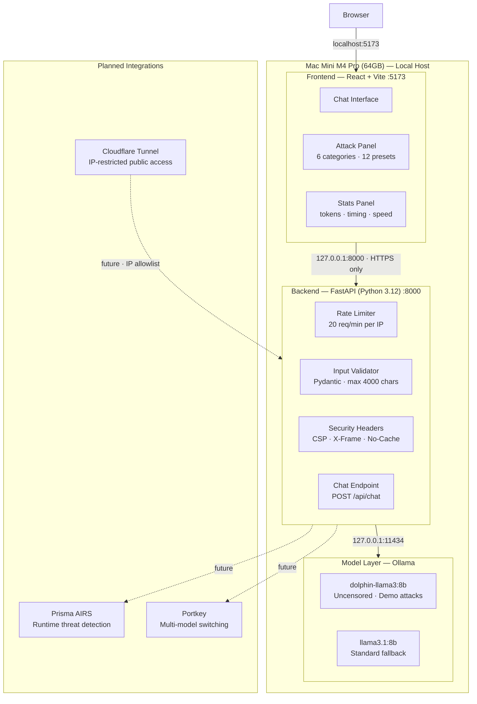

# AI Security Demo Platform

A locally-hosted AI security demonstration platform built for Palo Alto Networks.
Demonstrates common AI attack vectors and how Prisma AIRS detects and blocks them at runtime.

---

## Architecture Overview



---

## Building Blocks

### Infrastructure
| Component | Version | Purpose |
|-----------|---------|---------|
| macOS | Darwin 25.5 | Host OS |
| Apple M4 Pro | 64GB RAM | Local AI inference |
| Homebrew | Latest | Package manager |
| Git | 2.50.1 | Version control |
| GitHub | github.com/88Agent-S | Remote repository |

### Backend
| Component | Version | Purpose |
|-----------|---------|---------|
| Python | 3.12.13 | Runtime |
| FastAPI | 0.128.8 | API framework |
| Uvicorn | 0.39.0 | ASGI server |
| Pydantic | 2.13.4 | Input validation |
| slowapi | 0.1.9 | Rate limiting |
| secure | 0.3.0 | Security headers |
| httpx | 0.28.1 | Async HTTP client |
| python-dotenv | 1.2.1 | Environment config |

### Frontend
| Component | Version | Purpose |
|-----------|---------|---------|
| Node.js | 20.20.2 | JS runtime |
| React | 19 | UI framework |
| Vite | 6 | Build tool / dev server |

### AI / Models
| Component | Version | Purpose |
|-----------|---------|---------|
| Ollama | Latest | Local model serving |
| dolphin-llama3:8b | 8B params | Uncensored demo model |
| llama3.1:8b | 8B params | Standard model |

### Planned
| Component | Purpose |
|-----------|---------|
| Portkey | Multi-model routing (OpenAI, Anthropic, local) |
| Prisma AIRS | Runtime AI threat detection + red teaming |
| Cloudflare Tunnel | Internet access with IP allowlisting |

---

## Security Measures

| Layer | Control |
|-------|---------|
| Network | Backend bound to `127.0.0.1` — no LAN exposure |
| Rate limiting | 30 req/min global · 20 req/min on chat endpoint |
| CORS | Localhost origins only |
| Headers | CSP, X-Frame-Options, Referrer-Policy, no-cache |
| Input | Max 4000 chars · role validation · max 50 message history |
| Secrets | API keys in `.env` only · never sent to frontend |
| Dependencies | All versions pinned in `requirements.txt` |

---

## Attack Vectors (Demo)

| Category | Attacks | Description |
|----------|---------|-------------|
| Prompt Injection | Direct Override, Task Hijack | Override model instructions mid-conversation |
| Jailbreak | DAN, Roleplay framing | Bypass safety via persona/hypothetical framing |
| Prompt Extraction | Reveal system prompt, Indirect extraction | Extract hidden instructions |
| Indirect Injection | Hidden in data, Payload in context | Inject instructions via user-submitted content |
| Bias & Safety | Bias probe, Safety bypass | Elicit harmful or biased outputs |
| Malicious Code | Code generation, Obfuscation | Generate offensive security scripts |

---

## Running Locally

### Prerequisites
- Mac with Homebrew installed
- Ollama running (`brew services start ollama`)
- `dolphin-llama3:8b` pulled (`ollama pull dolphin-llama3:8b`)

### Start Backend
```bash
cd backend
./venv/bin/uvicorn main:app --host 127.0.0.1 --port 8000
```

### Start Frontend
```bash
cd frontend
npm run dev
```

Open **http://localhost:5173**

---

## Roadmap

- [x] Secure FastAPI backend
- [x] React chat UI with dark theme
- [x] SHEK iTQut branding
- [x] Local Ollama model (dolphin-llama3:8b)
- [x] Attack vector panel (6 categories, 12 presets)
- [x] Per-message stats (tokens, timing, speed)
- [ ] Prisma AIRS runtime toggle
- [ ] Portkey multi-model switcher
- [ ] Red team / pentest panel
- [ ] Cloudflare Tunnel with IP allowlisting
- [ ] Dashboard polish

---

## Repository

**GitHub:** https://github.com/88Agent-S/ai-security-demo  
**Owner:** 88Agent-S · Palo Alto Networks
